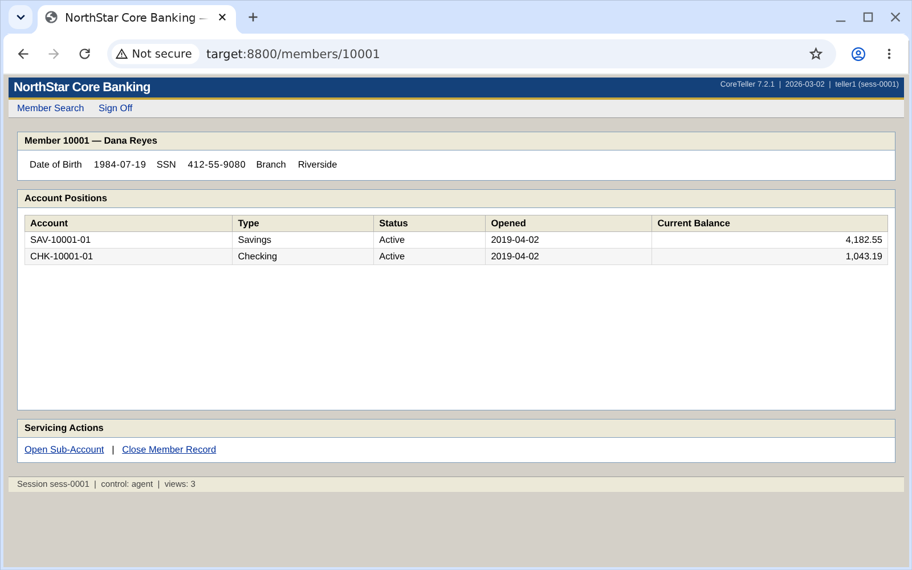
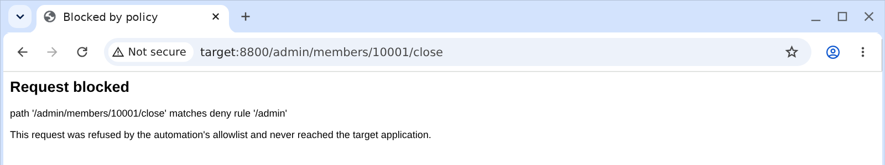
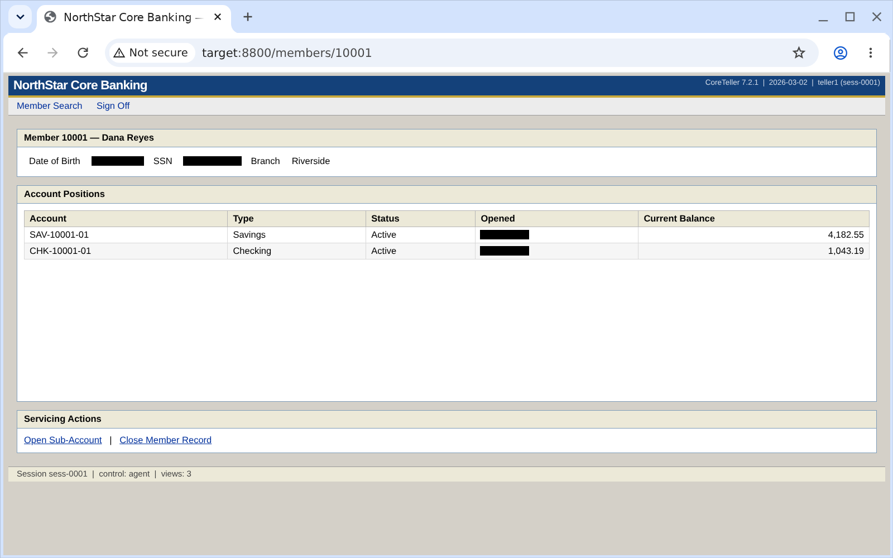
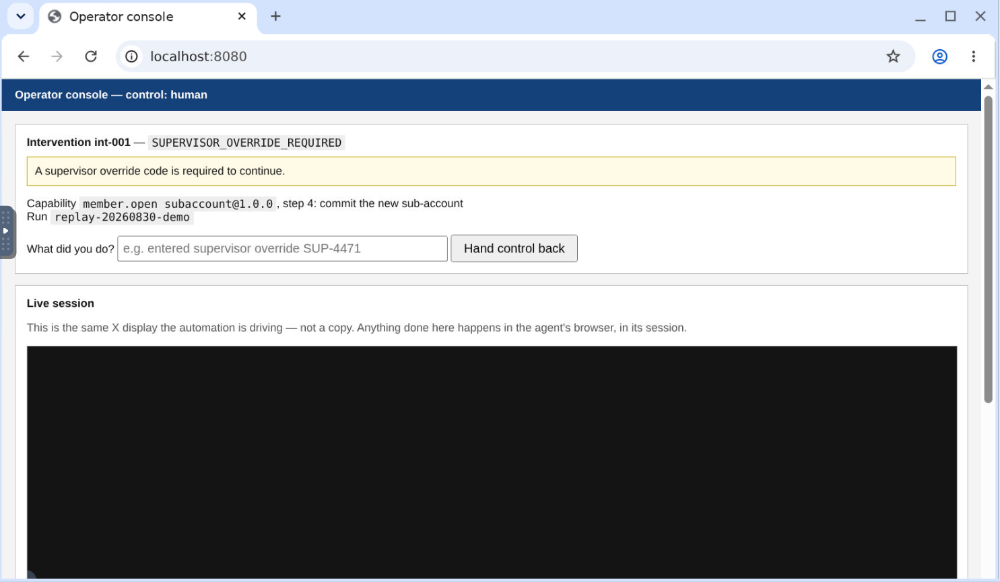

# Portal Automation

A **discover-once / replay-many** computer-use system for legacy bank back-office
software. It is built on the premise that if you want to automate a *machine*, you should be
driving a machine, not a browser tab.

**Nobody demonstrates the flow.** There is no macro recorder and no human input capture 
anywhere in this system. An LLM is given a goal and a screen, works the UI out for itself, 
and what gets "recorded" is the agent's own successful run — reduced to a typed capability 
artifact.

That artifact then replays deterministically with no model in the loop. All three halves
are working and evidenced in [`evidence/`](evidence/).

---

## What's different about this one

Most solutions to this brief will be Playwright driving a headless Chrome on the host,
with CSS selectors as the locator strategy. That works, and it is the wrong shape for
the environment the brief actually describes.

**This one runs the agent inside an isolated sandbox and acts at the OS level — screen,
keyboard, mouse.** No DOM is ever read. No selector is ever queried. That single decision
is what the rest of the design falls out of:

- **The DOM is an optimization, not the interface.** The brief says the real surfaces
  include native desktop apps and that you should bias toward approaches that survive
  *no clean DOM*. A screen-and-input contract survives it by construction. A selector
  strategy does not.
- **Guardrails are enforced by a boundary, not honored by the agent.** The browser runs
  behind a filtering proxy, so a denied route never leaves the sandbox — whatever the
  agent decides to click, and including requests no application code initiated.
- **Escalation hands over the actual screen.** A human attaches to the same X display the
  agent is driving, mid-run, and detaches when done. Same session, same browser process,
  same cookies, no fork.
- **The hostile target was built first.** [`mock_teller/`](mock_teller/README.md) is a
  deliberately legacy bank surface — nested tables, no test IDs, ASP.NET identifiers,
  balances hidden in an iframe — where every runtime condition class in the brief is
  reachable by one documented command.



*The target: nested tables, `ctl00_cph1_*` identifiers, no test IDs, and the savings
balance sitting in an iframe rather than the top-level document. The automation reads this
the same way you just did.*

---

## The bet: the surface is a machine, not a browser

There is a real fork in this assignment, and most of the interesting consequences follow
from which way you take it.

| | Host + Playwright | Host + OS automation | **Sandbox + OS automation** |
|---|---|---|---|
| Native desktop apps | ✗ out of reach | ✓ | ✓ same `Surface` contract |
| Survives no-clean-DOM | ✗ it *is* the DOM bet | ✓ | ✓ |
| Usable while it runs | ✓ headless | ✗ steals your mouse | ✓ it isn't your desktop |
| Reproducible screen | ✗ host DPI/fonts/size | ✗ | ✓ geometry, DPI, fonts pinned in the image |
| Allowlist enforced where | in-process check | in-process check | ✓ at the network edge |
| Live-session handoff | mocked console | your own desktop | ✓ attach to the same display |
| Regulated data | on your laptop | on your laptop | ✓ redacted before it is written |

The middle column is the honest-but-unusable one: OS-level control on the host means the
run fights you for the pointer, any stray keystroke corrupts it, and the screen it sees is
whatever your window manager happened to be doing. That's why most people retreat to the
left column, and buy the DOM assumption to get there.

**The sandbox makes the middle column usable.** You get OS-level fidelity *and* an isolated
environment with no opinion about what you're doing on your laptop at the time.

### What the sandbox is, precisely

A **Docker container running a real desktop** — Xvfb, a window manager, Chromium, x11vnc
and noVNC — not a virtual machine. Worth stating plainly, because it is a real trade-off
rather than a detail:

- **What it buys:** everything in the right-hand column, plus a one-command start
  (`docker compose up`) a reviewer can actually run, on a host with a few GB free.
- **What a VM would add that this does not have:** snapshot/restore of the whole machine
  between runs, a genuine network fence at the hypervisor, and a kernel boundary rather
  than a namespace one. Determinism here comes from the *target* being deterministic and
  from `POST /_control/reset` between runs — not from restoring a machine image.

The `Surface` abstraction is where that distinction stops mattering: it is `observe() ->
Frame` plus click / type / key / scroll, so a VM-backed or desktop-app-backed
implementation is a new class and nothing else. Nothing above it knows what it is driving.

---

## What that buys, against the parts of the brief that are hard

### Determinism

Replay consults no model: given the same artifact, the same inputs and the same target
state, it does the same thing every time. Two things make that checkable rather than
asserted:

- **A target that is itself deterministic.** The mock teller has no randomness anywhere:
  every variant is a pure function of `(profile, knobs, route, request counter)`, session
  ids and confirmation numbers are sequential counters rather than UUIDs, and two runs
  separated by a reset are byte-identical. Randomness would make a passing replay
  unfalsifiable.
- **A screen that means the same thing every run.** Display geometry, DPI scaling and the
  font set are fixed in the image. That is not cosmetic: the target renders 11px Verdana,
  which sits right at tesseract's limit, and recognition flips on sub-pixel layout shifts.
  The surface runs at 1.5× device scale for that reason alone.

The locator strategy is the other half. Perception is pixels, but a recorded *coordinate*
is worthless the moment anything reflows — so the artifact never stores one as its primary
target. Each step carries an ordered chain: an OCR text anchor with a spatial relation
("the box to the right of `Member Number`"), then a bounded template patch match, then the
raw coordinate. Replay reports which tier fired, so an artifact that has quietly stopped
resolving by label surfaces as drift instead of decaying invisibly.

A coordinate-only match is **refused**, not used. That is not caution for its own sake: a
run whose session had expired once clicked recorded coordinates through a stale page the
previous run left on screen, matched its checkpoint against that page, and reported
success with a balance it never fetched. A coordinate is a position, not an
identification.

### Guardrails that are enforced rather than honored

An allowlist implemented as `if not allowed(url): raise` is an honor system. It protects
you from an agent that decides to misbehave and not at all from a bug, a prompt injection
in the page, or a step recorded against the wrong route.

It is doubly an honor system here, because perception is pixels: the agent cannot reliably
read its own address bar. So the policy lives at the network edge instead — Chromium is
launched behind a filtering proxy that every request passes through.



*`/admin/members/10001/close` — a genuinely destructive route the target ships so the
allowlist has something real to refuse. The proxy answers; the application never hears
about it.*

In one evidence session the proxy denied 124 requests, and almost none came from the
automation: 76 `CONNECT www.google.com:443` probes, 45 favicon fetches off the allowlisted
paths, and three further `CONNECT` attempts to Google endpoints. The browser phones home
constantly and none of it left the sandbox. No in-process check would have seen any of it,
because no application code initiated it.

Two more properties worth naming:

- **Regulated data is redacted where it becomes durable.** Frames are OCR'd for SSN- and
  date-shaped values and masked *in pixels* before any screenshot is written. The count of
  masked regions goes into the run log, so a reviewer staring at a black box can tell
  *withheld* from *absent*.
- **Irreversible steps need two independent gates:** the capability must be human-approved,
  and the run must pass `--allow-irreversible`. Either alone is one mistake from opening
  real accounts. A blocked irreversible step escalates rather than fails.



*An evidence frame. SSN and date of birth blacked out; the opening dates too, because from
pixels alone a DOB and an opening date are indistinguishable and the wrong error to make is
the one that leaks. The balances — what the capability was asked for — survive.*

### Handoff that is a handoff

The brief scopes a real-time co-browsing console out and says a mocked operator surface is
fine as long as the control-transfer model is real. Here "let the human operate the same
live session" stops being a metaphor: `x11vnc` publishes the very display the agent is
driving, so an operator opening noVNC shares its screen, its browser process and its
cookies. There is no second session to diverge, because there is only one.



*The console holding control, with the intervention's context — capability, step, and why
it stopped — and the live view of the agent's display embedded beneath. (The pane is black
in this capture because noVNC had not finished connecting.)*

Control is a single flag with one owner at a time, and the automation genuinely blocks
while the human works — any design where it keeps acting produces two actors racing on one
session.

The transfer is also announced to the application, which makes that evidence independent of
anything this system writes. `POST /_control/handoff` doesn't create a session, swap
cookies or fork state — it flips the actor on the session already running, so a single
continuous audit log *proves* the human operated the live session:

```
 1 sess-0001  agent  nav     sign on as teller1
 2 sess-0001  agent  submit  draft staged
 3 sess-0001  agent  submit  committed SAV-10001-03 (CNF-000001)
 4 sess-0001  human  control control transferred agent -> human
 5 sess-0001  human  nav     viewed 10005
 6 sess-0001  agent  control control transferred human -> agent
```

Note the deliberate asymmetry: the harness may reach `/_control`; the agent may not.
Arranging a handoff and letting an agent reconfigure its own target are different acts.

There is a condition in the target that exists only to force this path: member `10005`
demands a supervisor override code on commit, and the agent has no way to obtain one.
Escalating is not a fallback there — it is the single correct move.

### Credentials, which the agent never touches

Sign-on is a harness precondition ([`cua/bootstrap.py`](cua/bootstrap.py)), performed
deterministically before the model is involved. That began as a response to a policy
refusal — discovery was declined twice under the `cyber` policy, both times exactly when
the model went to type a password into a login form — and the refusal turned out to be
pointing at a design flaw rather than obstructing one. Authentication is a precondition,
not part of a capability. A recorded flow now contains no secrets at all, which is a much
easier property to audit than careful redaction. The brief's own example goal likewise
begins after sign-on.

### Heterogeneity, mostly for free

When the action contract is screen, keyboard and mouse, a desktop app is not a new
backend — it's a different-looking window. The seam between "how we perceive and act on a
surface" and "the recorded flow" is the `Surface` protocol, which offers no
`query_selector` precisely so nothing above it can come to depend on one.

The other half is a locator question, and the target tests it honestly. Two tenants are
mounted from a single config — same handlers, same data, different nouns (*Member* vs
*Customer*), different query parameters, different form field order, different product
versions. Those differences are chosen to be exactly the ones that break a positional
strategy and survive a label-anchored one, and `TextAnchor.aliases` carries the noun drift
so one artifact can serve both.

---

## The target surface

[`mock_teller/`](mock_teller/README.md) — a deliberately hostile stand-in for the core
banking screens the brief says we won't get access to. It was built first, on purpose: the
automation side is bounded by how many *interesting* conditions its target can produce on
demand, and a happy-path surface makes the error taxonomy, the escalation path and the
guardrail model untestable.

Every condition class in the brief is reachable with one documented command: validation
errors, record-not-found, permission denial, unexpected dialogs (both a DOM interstitial
*and* a native `window.confirm()`, which are deliberately different problems), session
expiry, transient 503s, deferred loads, hard 500s, a hanging route, duplicate commits of an
irreversible write, and a stuck state whose only correct resolution is escalation.

Full catalogue, determinism argument and hostility inventory:
**[mock_teller/README.md](mock_teller/README.md)**.

---

## Quickstart

### Without Docker or an API key

Most of the system is testable with neither. The perception layer runs against a real
screenshot fixture; the replay engine runs against a scripted fake surface that renders
real PNGs and is read with real OCR.

```bash
python3 -m venv .venv
.venv/bin/pip install -r requirements.txt -r requirements-cua.txt
sudo pacman -S tesseract tesseract-data-eng      # or: apt-get install tesseract-ocr

.venv/bin/python -m pytest tests/ tests_cua/ -q  # 121 tests
```

### The whole thing

```bash
cp .env.example .env        # repo root, NOT docker/; add your ANTHROPIC_API_KEY
docker compose -f docker/compose.yaml up --build
```

`.env` belongs at the repo root: Compose interpolates `${VAR}` against the *project*
directory (`docker/`), so the service takes an explicit `env_file: ../.env` instead. Only
`discover` needs the key.

| | |
|---|---|
| the application, for your own eyes | <http://localhost:8800> |
| **the agent's live screen** (noVNC) | <http://localhost:6080/vnc.html> |
| operator takeover console | <http://localhost:8080> |

---

## Demo path

All commands run inside the workbench:

```bash
docker compose -f docker/compose.yaml exec workbench bash
```

### 1. Discovery — one real LLM-driven run

```bash
python -m cua.cli discover \
  --goal "Look up member 10001 and read their current savings account balance." \
  --checkpoint "Account Positions" \
  --param member_no=10001 \
  --output 'savings_balance:money:Savings:([0-9,]+\.[0-9]{2})' \
  --save member.read_savings_balance \
  --title "Read a member's savings balance" \
  --reset
```

The model gets screenshots and a mouse, nothing else — no DOM, no selectors, no hints
about the app. `--param` both parameterises the literal in the recorded steps and declares
it in the contract; `--output` declares what the capability returns. The artifact is saved
as a **draft**, with any step whose targeting could not be validated printed for review.

### 2. Replay — the production path, no model

```bash
python -m cua.cli replay member.read_savings_balance@1.0.0 --param member_no=10001 --reset
```

```
[OK] member.read_savings_balance@1.0.0  (3 steps)
  outputs:
    savings_balance = 4,182.55
  evidence: evidence/runs/replay-20260830-173725
```

That balance is inside an iframe. Screenshot perception never notices, because pixels have
no document tree.

### 3. The interesting replays

Each is a different *kind* of result, not a different error message:

```bash
# A legitimate answer, not a failure.
python -m cua.cli replay member.read_savings_balance@1.0.0 --param member_no=99999 --reset
#   [OUTCOME] RECORD_NOT_FOUND

# A permission denial is also an answer.
python -m cua.cli replay member.read_savings_balance@1.0.0 --param member_no=10003 --reset
#   [OUTCOME] PERMISSION_DENIED

# Recoverable: a transient 503 and a maintenance interstitial, absorbed and logged.
python -m cua.cli replay member.read_savings_balance@1.0.0 \
  --param member_no=10001 --reset --profile flaky
#   [OK] ... recovered: SERVICE_BUSY via retry_after, MAINTENANCE_INTERSTITIAL via dismiss

# A hard failure, at a named step.
python -m cua.cli replay member.read_savings_balance@1.0.0 \
  --param member_no=10001 --reset --override '{"error_500_on":["search"]}'
#   [FAILED] SERVER_FAULT
```

### 4. The catalogue an agent would call

```bash
python -m cua.cli catalog --json
```

Each capability's id, typed parameters, typed outputs and approval state — the contract a
calling agent needs, without reading the step list.

---

## Status

| Piece | State |
|---|---|
| Target surface (`mock_teller/`) | ✅ 30 tests, byte-identical across resets |
| Sandbox image + lifecycle | ✅ two services, `docker compose up` |
| Agent loop (observe → decide → act) | ✅ real Opus 5 run, 9 actions, screenshots only |
| Artifact schema | ✅ typed, versioned, self-validating targets |
| Deterministic replay engine | ✅ four-way result contract, no model in the loop |
| Guardrails (proxy allowlist, redaction, approval) | ✅ evidenced |
| Escalation + live-session handoff | ✅ mechanism + tests — ⚠️ no end-to-end run yet |
| Evidence (`evidence/`) | ✅ discovery + five replays, with frames |
| [`REPORT.md`](REPORT.md) | ✅ |

**The one gap:** the escalation path has not been run end to end against the live surface.
It needs the write flow — opening a sub-account, where the supervisor-override stuck state
lives — whose capability has not been discovered yet. The mechanism is covered by
`tests_cua/test_escalation.py`.

---

## Layout

```
cua/             the automation system
  surface/         the seam: observe() + human-shaped actions, no query_selector
  perception/      OCR, the three-tier locator chain, template matching
  artifact/        the capability schema and its versioned store
  agent/           the discovery loop, and the recorder that turns runs into artifacts
  replay/          the deterministic engine and the error taxonomy
  safety/          policy rules, pixel redaction, and the enforcing proxy
  escalation/      control transfer and the operator console
mock_teller/     the hostile target surface (see its README)
docker/          two services: target, workbench
capabilities/    recorded artifacts, one file per version
evidence/        the discovery run, five replays, frames, proxy audit
docs/media/      screenshots
```

The design reasoning — every decision above, its trade-offs, and what was deliberately cut —
lives in **[REPORT.md](REPORT.md)**.
